# Word-Hunt
# Welcome to Word-Hunt,a fun interactive fruit themed word guessing game!

Word-Hunt is a terminal-based game where players guess a hidden 5 letter fruit word within six attempts. This fun and engaging game offers a blend of luck and logic, giving players a delightful break from their daily routine. While it focuses on the simple joy of guessing fruit names, it also subtly enhances problem-solving and vocabulary skills, making it both entertaining and educational.

Players receive immediate feedback on their guesses, with correct and incorrect letters highlighted to guide their next move. If you're stuck, you can type 'hint' to get a clue. The game tracks high scores using Google Sheets, making each game session competitive and rewarding.

The live link can be found here - [Word-Hunt](https://word-hunt-73b4f6b952fd.herokuapp.com/)

![Site Mockup]???

## How to Play
1. **Start the Game**:
   - Launch the game from your terminal.
   - You will be greeted with a welcome message and the main menu.

2. **Main Menu Options**:
   - **Instructions**: View the game instructions.
   - **Play Game**: Start a new game.
   - **High Scores**: View the top scores.
   - **Exit Game**: Quit the game.

3. **Enter Your Name**:
   - When you choose to play the game, you will be prompted to enter your name.
   - Ensure your name is less than 10 letters and contains only alphabets.

4. **Guess the Word**:
   - The game will randomly select a hidden fruit word.
   - You have six attempts to guess the word.
   - Enter a 5-letter fruit name as your guess.

5. **Hints**:
   - If you need help, type 'hint' to receive a clue about the fruit.
   - Use hints wisely to aid in guessing the correct word.

6. **Feedback on Guesses**:
   - Correct letters in the right position will be highlighted in green.
   - Incorrect letters will be highlighted in red.
   - Use this feedback to refine your guesses.

7. **Winning and Scoring**:
   - If you guess the word correctly, a congratulatory message will be displayed.
   - Your score is calculated based on the remaining attempts and recorded in the high scores list.
   - If you exhaust all attempts without guessing the word, the game will reveal the correct word.

8. **Play Again**:
   - After each game, you can choose to play again or return to the main menu.

9. **High Scores**:
   - View the top 10 scores, including player names, scores, and dates.
   - Compete to achieve the highest score by guessing correctly with the fewest attempts.

## Site Owner Goals
 - Provide a Challenging and Rewarding Experience: Offer users a simple yet engaging game that tests their skills and provides a sense of accomplishment.
 - Ensure App Functionality and User-Friendliness: Deliver an app that operates smoothly, with intuitive controls and clear instructions, ensuring an enjoyable user experience.
 - Encourage User Engagement and Improvement: Motivate users to revisit the game by setting score improvement as a goal, fostering a desire for ongoing participation and achievement.

 ## User Stories
 - ### As a user I want to:
   - As a player, I want to guess a hidden fruit word within six attempts, receiving feedback on correct and incorrect guesses.
   - As a user, I want to receive hints during the game to help me guess the fruit word more accurately.
   - As a player, I want the game interface to be intuitive and easy to navigate.
   - As a user, I want my high scores to be recorded and displayed to track my progress.
   - As a player, I want the game to provide a relaxing and enjoyable experience during breaks.
   - As a user, I want the game to challenge my problem-solving skills and expand my vocabulary.

   ## Logic Flow
   I used Lucid Chart to create a flowchart that outlines the sequential steps and interactions necessary for the Word-Hunt game. This planning tool was invaluable as it helped me visualize the required functions and their integration throughout the game's development process.

   Initially, the flowchart provided a comprehensive overview of the game's structure, highlighting key functionalities and their interdependencies. However, as the project evolved, additional elements and features were integrated into the game, which are not fully represented in the initial flowchart.

   Furthermore, the flowchart facilitated the identification of essential objects required for implementation. I particularly focused on leveraging Object-Oriented Programming principles to enhance code modularity and scalability, ensuring a robust and maintainable game application.

   Overall, the initial flowchart served as a foundational blueprint, guiding the development process and ensuring alignment with the game's objectives. However, continuous iteration and refinement were essential to incorporate all planned elements and optimize the game's functionality and user experience.
   [!Flow chart] 
## Features
  ### Welcome Screen
   - User-Friendly Interface: The game starts with a warm and inviting welcome screen created using rich text styling.
    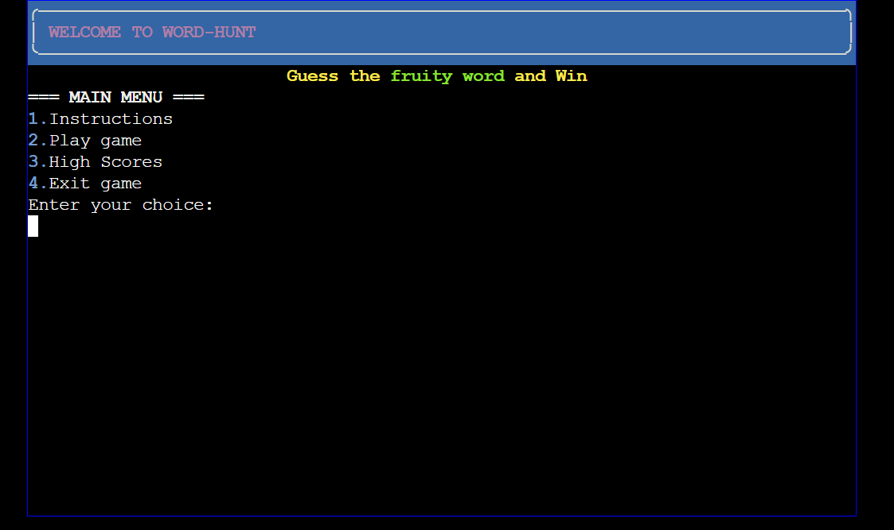
  ### Menu Options
    The welcome screen presents the main menu with the following options:
   - Instructions:  Provides clear guidelines on how to play the game, ensuring players understand the rules and objectives.
   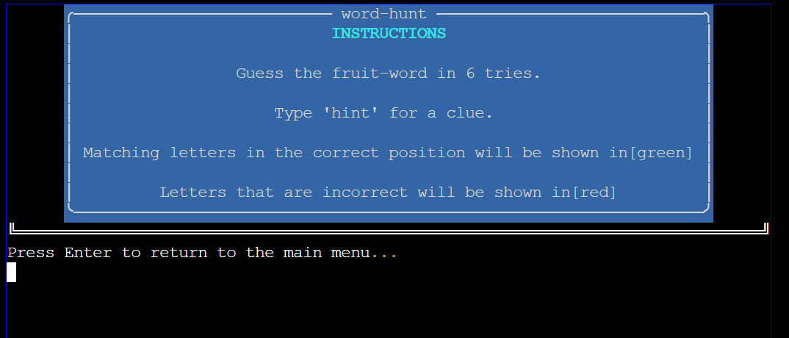
   - Play Game: Initiates the game where players guess a hidden 5 letter fruit word within six attempts. Players receive feedback on their guesses with correctly guessed letters highlighted in green and incorrect letters in red. Hints are available to aid progress.
     - Player Name Input: Players are prompted to enter their name, which is validated to ensure it is less than 10 letters and alphabetic.
     
 - High Scores: Displays the top 10 high scores achieved by players, promoting competition and encouraging replayability.
 - Exit Game: Allows users to gracefully exit the game when they are finished, ensuring a smooth user interaction.
 - By implementing user choice validation, the game ensures that users only input valid menu options, reducing errors and guiding them through the game's interface effectively.
 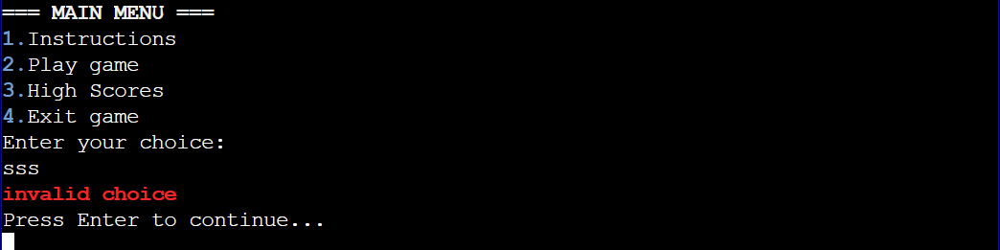
 

  ### Gameplay
  - Players are prompted to enter their name, which is validated to ensure it is alphabetic and less than 10 letters.
  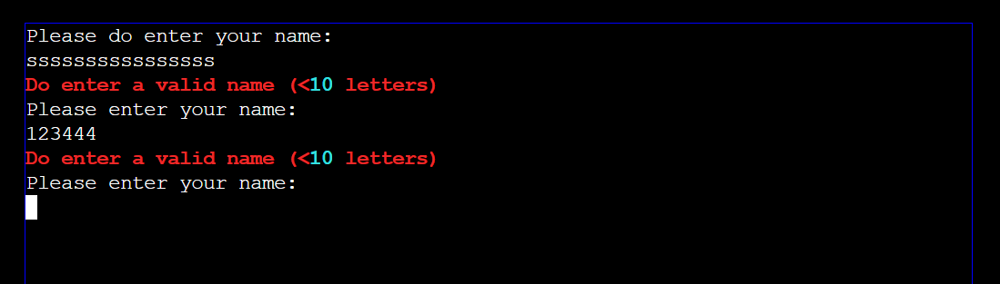
  - Guessing the Word:Players are required to guess a hidden fruit word within six attempts. Incorrect guesses decrease the number of attempts left.
  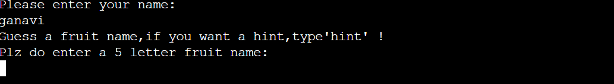
  - Hints: Players can type 'hint' to receive a clue about the hidden word.
  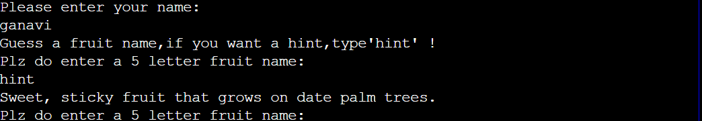
  - Feedback: Correct letters in the correct position are highlighted in green, while incorrect letters are highlighted in red.
  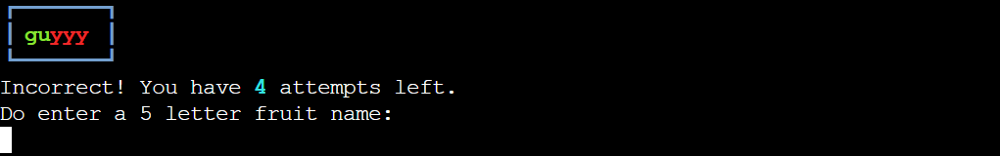
  - Victory and Defeat: If the player guesses the word correctly within six attempts, a "You Won" message is displayed. If they fail to guess the word, a "Game Over" message is shown along with the correct word.
  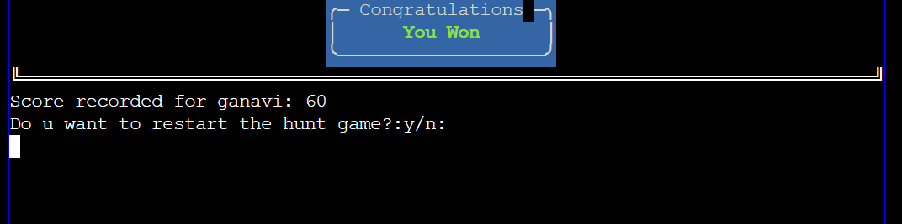
  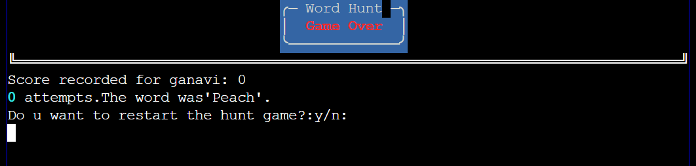
  ### High Scores Tracking
  - Google Sheets Integration: Scores are recorded and tracked using Google Sheets. This allows for persistent high score tracking across game sessions.
  - Leaderboard Display: The top 10 high scores are displayed in a formatted table, showing rank, player name, score, and date achieved.
  - The Leaderboard feature in my Word-Hunt game leverages Google Sheets accessed via the Google Drive and Google Sheets APIs hosted on the Google Cloud Platform. Secure credentials for API access were managed in creds.json, excluded from version control using .gitignore, and configured as Heroku Config Vars for runtime access. Scores are organized by player name,score and date, motivating players to revisit and achieve top scores daily. Data sorting and formatting within the leaderboard functionality were achieved using rich for styling, datetime for timestamp management, and panel for structured interface presentation.
  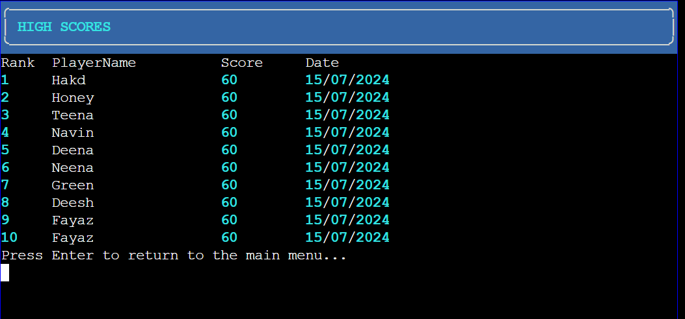
  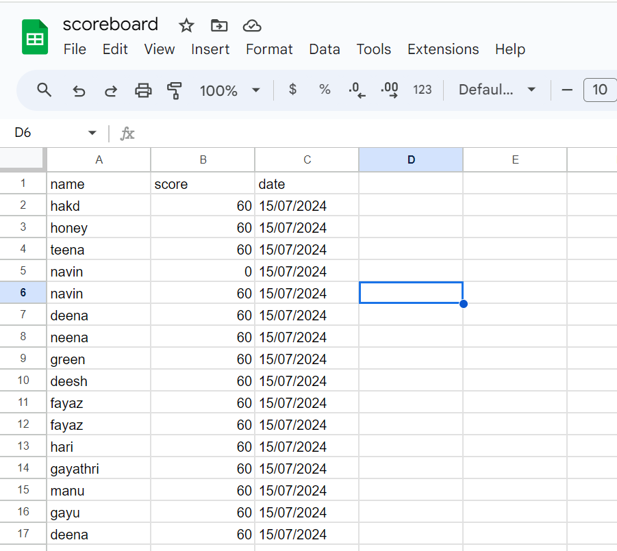
  
  ### User Feedback and Error Handling
   - Invalid Input Handling:The game handles invalid inputs gracefully, prompting users to enter valid options when they make a mistake.
   - Case-Insensitive Input: The game accepts both lower and upper case inputs for guesses, converting them to a uniform format internally.
   - Clear Screen Functionality: The game uses a function to clear the terminal screen at various points to enhance readability and provide a clean interface.

   ### End Game Options
   - Replayability: After each game, players are asked if they want to play again. Choosing 'yes' restarts the game, allowing for continuous play.
   - Exit Option: Players can choose to exit the game at any point, with a graceful exit message displayed.
   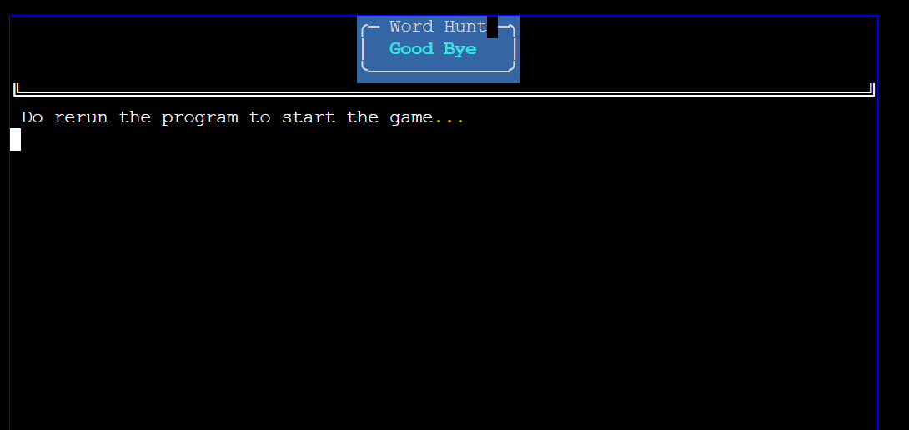
   ### Future Features
   - I plan to enhance the Word-Hunt game by replacing the static JSON file with a dynamic dictionary API to fetch words. This API integration will allow for a more varied and engaging gameplay experience with a broader range of word choices.
   -  Incorporate images related to the guessed words. For example, when a player correctly guesses "apple," display an image of an apple alongside the confirmation message. This visual reinforcement can enhance the gaming experience and reinforce learning.
   ### Data Model for Word-Hunt Game
   1. Google Sheets Integration
Google Sheets: Utilized for storing and managing game scores.
Spreadsheet: Named "scoreboard".
Worksheet: "score" within the "scoreboard" spreadsheet.
2. Game Components
Game Logic: Implemented using Python.
Console Interaction: Managed through the rich library for enhanced text styling and user interface.
3. Data Flow and Storage
Credentials: Stored securely in creds.json for Google Sheets API access.
Score Recording: Appends player name, score, and date to the Google Sheets upon game completion.
Data Structure: Each entry consists of three fields: Player Name, Score, and Date.
4. Game Features
Start Menu: Displays options such as Instructions, Play Game, High Scores, and Exit Game.
Instructions: Displays game rules and hints using styled text.
Gameplay:
Guessing Mechanism: Players guess a 5-letter fruit word with hints available.
Attempts: Limited to 6 tries per game session.
Outcome: Displays whether the guess is correct or incorrect, deducting attempts accordingly.
5. High Scores Display
Top Scores: Displays the top 10 scores from the Google Sheets.
Sorted: Scores are sorted in descending order based on the score value.
6. Main Program Flow
Main Function: Controls the flow of the game from start to finish.
Loop: Continues until the player chooses to exit.
7. Additional Libraries
Dependencies:
gspread: Python API for Google Sheets.
rich: Used for styling and formatting console output.

  [!Menu]

### Deployment
The site was deployed via Heroku, and the live link can be found here: [Word-hunt](https://word-hunt-73b4f6b952fd.herokuapp.com/)

Before deploying to Heroku pip3 freeze > requirements.txt was used to add all the dependencies required to the requirements.txt file. This is required for the game to run on Heroku.
The following steps were then taken:
1. Log in to Heroku or create an account.
2. On the main page click the button labelled New in the top right corner and from the drop-down menu select "Create New App".
3. Enter a unique and meaningful app name.
4. Next select your region.
5. Click on the Create App button.
6. Click on the Settings Tab and scroll down to Config Vars.
7. Input CREDS and the content of your Google Sheet API creds file as another config var and click add.
8. Next, scroll down to the Buildpack section click Add Buildpack select Python and click Save Changes
9. Repeat step 8 to add node.js. Note: The Buildpacks must be in the correct order. If not click and drag them to move into the correct order.
10. Scroll to the top of the page and choose the Deploy tab.
11. Select Github as the deployment method.
12. Confirm you want to connect to GitHub.
13. Search for the repository name and click the connect button.
14. Scroll to the bottom of the deploy page and either click Enable Automatic Deploys for automatic deploys or Deploy Branch to deploy manually. Manually deployed branches will need re-deploying each time the repo is updated.
15. Click View to view the deployed site.

The site is now live and operational.
### User Input Testing
 - Username Input:
   - Ensured that usernames cannot be empty or consist solely of whitespace.
   - Validated that usernames must contain only letters
   - Implemented input validation using the strip() method to remove excess whitespace.
- Menu Options Selection:
  - Validated error handling for inputs numbers from (1-4) that do not match any menu options, providing appropriate feedback.
- Guess Input:

  - Verified that guesses must be exactly five characters long.
  - Implemented validation to reject guesses containing numbers.
  - Integrated validation to ensure guesses are actual words from the json file.
- Feedback Messages
  - Ensured clear and informative feedback messages for each type of input validation.
  - Verified that users receive appropriate information regarding game progress and outcomes.
- Other Game Features Testing
Random Word Selection: Confirmed a new word is chosen randomly at the start of each game session.

- Chances and Game Over: Tested reduction of chances with each guess and ensured game termination upon running out of chances or guessing correctly.

- Leaderboard Functionality: Verified leaderboard updates upon correct guesses and accurate sorting and display of high scores.

- Terminal Functionality: Ensured terminal clears appropriately between game sessions and displays updated information correctly.

- Environment and Deployment
  - Conducted tests locally and on Heroku to ensure consistency across different environments.
  - Ran the README.md through Grammarly and verified all links before final submission.

### Libraries and Technologies Used
- Programming Languages:
  - Python:Used as the primary programming language for developing the Word-Hunt game.

- Libraries:
  - gspread: Used for accessing Google Sheets API to store and retrieve leaderboard scores.
  - google-auth: Utilized for handling authentication with Google services, necessary for accessing Google Sheets and Drive.
  - random: Employed for generating random choices, specifically for selecting words from a list of fruits.
  - json: Used to read and parse data from the "fruits.json" file, which contains the dictionary of fruits used in the game.
  - os: Utilized for clearing the terminal screen, providing a cleaner interface during gameplay.
  - datetime: Used for capturing and formatting timestamps to record scores with dates in the leaderboard.
  - rich: Used for styling text output in the terminal, providing a more interactive and visually appealing user interface.

- Tools and Platforms:
  - Google Sheets: Used as a cloud-based spreadsheet for storing and displaying leaderboard scores.
  - Heroku: Deployment platform used to host and run the Word-Hunt game online.
- Documentation and Collaboration
  - README.md: Used for documenting game instructions, setup, and information about libraries and technologies used.
 

## Credits
### Resources Used

